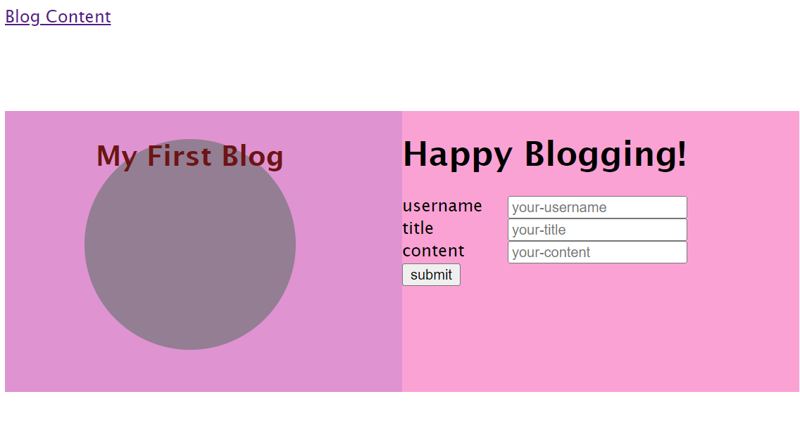
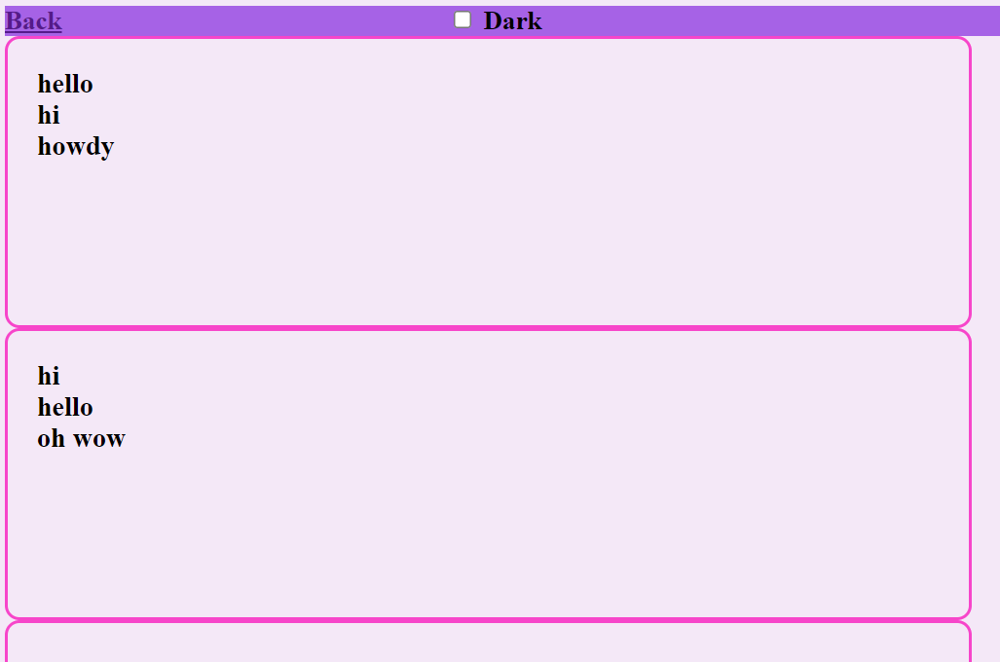
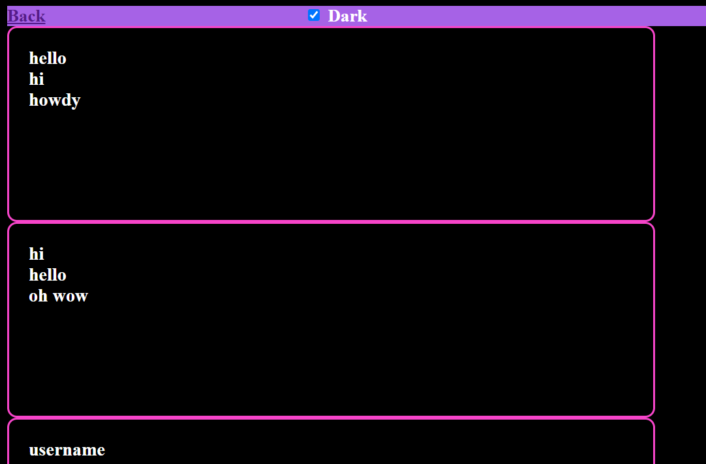

This blog-post project is a two-page website that includes"
View blog post, content form, light/dark mode toggle, and interactive JavaScript,HTML, and CSS mixture.

when the app is loaded, the home page includes a form with labels and inputs for username, title, and content.
when the form is submitted, the blog post data is stored to the localStorage.
when the form is submitted, we are directed to the posts page.
when entry is submitted with an empty section, we get an error to complete the form.
In the posts page, we can view the header with light/dark mode and "Back" button.
The Back button redirects us to the home/landing page.
In the posts page, we are shown a list of Blog posts that are pulled from the localStorage.
We are presented with JSON array of blog post objects including username, title, and content.
In the footer section, we have the link to the developer's portfolio.

Here are a few preview pictures: 

Thank you